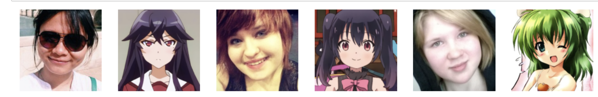

# CycleGAN-PyTorch

A PyTorch implementation of CycleGAN for image-to-image translation tasks. This project aims to transfer the style of one image domain to another while preserving the content of the original image.



## Table of Contents

- [Features](#features)
- [Requirements](#requirements)
- [Installation](#installation)
- [Usage](#usage)
- [Dataset](#dataset)
- [Training](#training)
- [Results](#results)
- [Contributing](#contributing)
- [License](#license)

## Features

- Cycle-consistent image translation using CycleGAN architecture
- Implementation of generators and discriminators
- Data augmentation and preprocessing
- Training and evaluation scripts
- Pre-trained model weights for quick inference

## Requirements

- Python 3.6+
- PyTorch 1.7+
- torchvision
- tqdm
- numpy
- Pillow
- matplotlib

You can install the required packages using pip:

```bash
pip install -r requirements.txt
```


## Installation

```bash
git clone https://github.com/yourusername/CycleGAN-PyTorch.git
cd CycleGAN-PyTorch
```

## Usage
### Preparing the Dataset
Place your images in the imgs directory, separating them into trainA and trainB folders. For example:
```bash
selfie2anime/
├── trainA/
│   ├── image1.jpg
│   ├── image2.jpg
├── trainB/
│   ├── image1.jpg
│   ├── image2.jpg
```

[You can download the data here](https://opendatalab.org.cn/OpenDataLab/selfie2anime/tree/main/raw)

### Training the Model
Run the training script with your desired parameters:
```bash
python train.py --root ./imgs --bs 1 --lr 1e-4 --epochs 100 --save_dir ./weights
```


### Inference
```
from PIL import Image
from torchvision import transforms

image = Image.open("./imgs/trainA/example.jpg")
# Perform image transformation and model prediction here
```

## Training
* The model utilizes Adam optimizer for training.
* Loss functions include MSE and L1 loss for GAN and cycle consistency.

## Results
Include sample results after running inference or training. You can also show side-by-side comparisons of input and output images.

## License
This project is licensed under the MIT License.